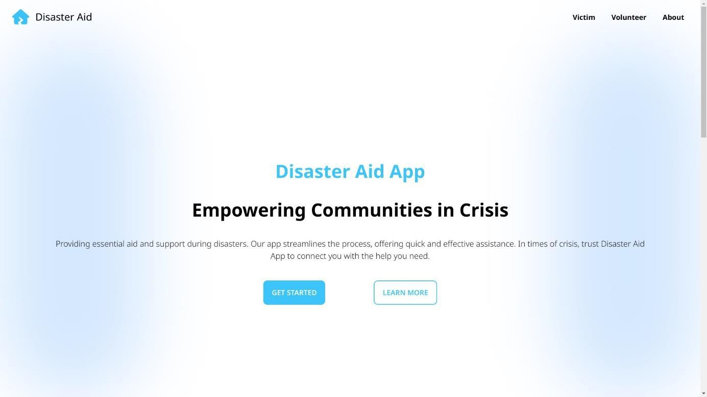
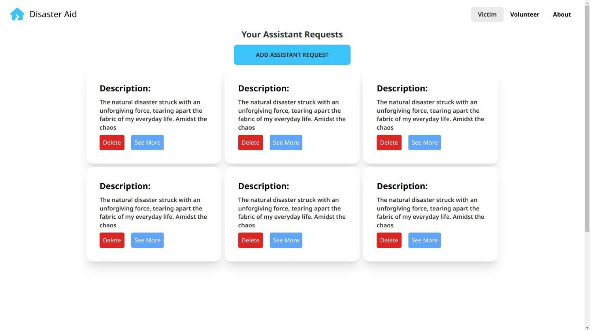
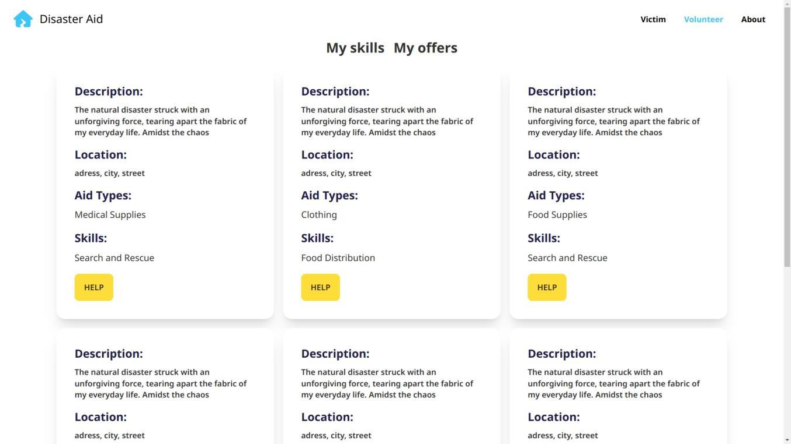
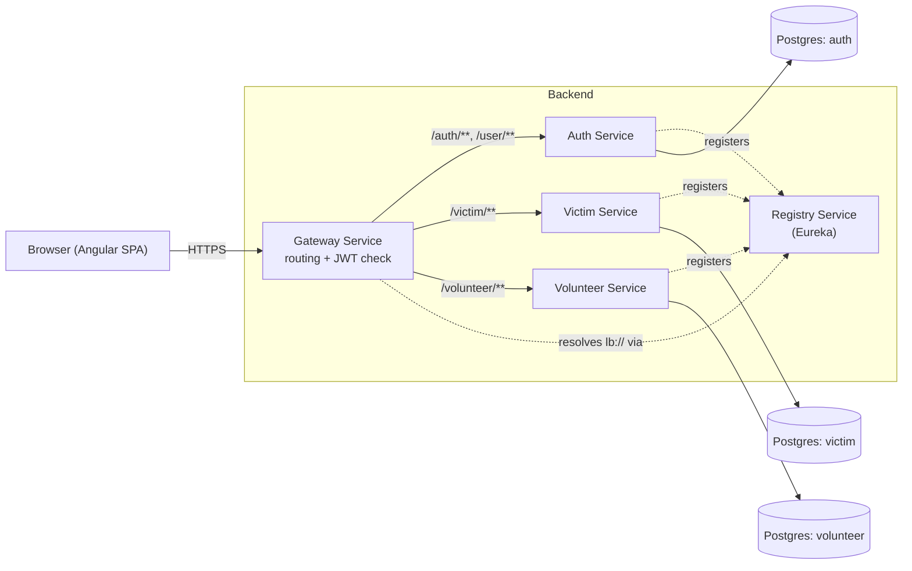

# Disaster Aid App

A platform connecting people who need help during a disaster with volunteers who want to help — built with Spring Boot microservices on the backend and an Angular frontend. This was originally a school DevOps project (Génie Informatique), and it's since been consolidated, fixed up, and documented properly so it's actually usable by someone who isn't me.

| | |
|---|---|
|  |  |
|  | |

## The short version

A victim posts what they need — water, medical supplies, whatever — along with where they are. A volunteer browses those requests and offers to help, or logs skills/donations they can offer. Five backend services handle this (auth, one service each for the victim side and the volunteer side, plus a gateway and a service registry so they can all find each other), and an Angular app ties it together for actual humans to use.

It started life as **six separate GitHub repos** under one org — one per service, each with its own Jenkins pipeline. That setup made sense for a class project split across teammates, but it's not something I wanted representing my work going forward, so I pulled everything into one repo, went through the code service by service, and fixed what needed fixing. More on that below.

## How it's actually put together



Nothing revolutionary here — it's a pretty textbook Spring Cloud setup. The Gateway is the only thing a browser ever talks to directly; it checks the JWT on every request that needs one, then forwards it to whichever service actually owns that data. Services find each other through Eureka instead of hardcoded addresses, which mostly matters if you ever want to run more than one instance of something. Each backend service has its own Postgres database — nobody reaches into anybody else's tables directly.

If you want to trace an actual request end to end (what the Gateway checks, what order things happen in, where the auth token actually gets verified), I go through it in a lot more detail in a personal notes file I keep locally — it's not part of this repo (see the `.gitignore`), but happy to share it if you're curious about the internals.

## What's using what

- **Backend:** Spring Boot (3.1 on most services, 3.2 on victim-service — never got around to aligning them), Java 21, Spring Cloud Gateway + Netflix Eureka for routing/discovery, Spring Security + JWT for auth, PostgreSQL, Spring Boot Actuator for health checks.
- **Frontend:** Angular 16, Tailwind + DaisyUI for styling.
- **Running it:** Docker (multi-stage builds, so nothing needs Java/Node/Maven installed on your machine to run this — just Docker), Docker Compose for local dev, Kubernetes manifests for anyone who wants to actually deploy it somewhere.
- **CI:** GitHub Actions. Used to be six Jenkins pipelines; see below for why that changed.

## Project layout

```
disaster-aid-app/
├── backend/
│   ├── registry-service/    # Eureka - service discovery
│   ├── auth-service/        # accounts, login, issues JWTs
│   ├── gateway-service/     # the only public entry point; checks auth, routes requests
│   ├── victim-service/      # assistance requests, locations, skills, aid types
│   ├── volunteer-service/   # volunteer skills, offers, donations
│   └── postgres-init/       # creates the 3 databases on first run
├── frontend/                # the Angular app
├── k8s/                     # Kubernetes manifests, if you want to deploy this somewhere
├── docker-compose.yml       # spins up the whole thing with one command
├── .env.example
└── .github/workflows/       # CI
```

Each service also has its own README with its actual endpoints and config — this file is the "how does the whole system work" view, theirs are the "I just want to touch this one service" view.

## Running it yourself

You need Docker and Docker Compose. That's genuinely it — everything else builds inside containers.

```bash
git clone https://github.com/<your-username>/disaster-aid-app.git
cd disaster-aid-app
cp .env.example .env
```

Then generate a JWT secret and drop it into `.env`:

```bash
openssl rand -base64 32
```

Open `.env`, set `JWT_SECRET=` to whatever that printed. This is the one thing you actually have to do — `auth-service` signs tokens with it and `gateway-service` checks them with the same value, so if it's missing, neither one will even start (on purpose — I'd rather it refuse to boot than quietly run with a predictable key). Everything else in `.env.example` already has a sane default for local use.

Now:

```bash
docker compose up --build
```

First run takes a few minutes — it's compiling five Spring Boot services and building the Angular app from scratch, not just pulling prebuilt images. After that it's fast. Postgres comes up first, then the service registry, then auth/victim/volunteer once the database's ready, then the gateway, then the frontend — Compose handles all of that ordering on its own through health checks, you don't need to babysit it.

Once it's up:

| | |
|---|---|
| App | http://localhost:4200 |
| API (through the gateway) | http://localhost:8080 |
| Eureka dashboard | http://localhost:8761 (nice for confirming everything actually registered) |

Sign up, log in, and you're in.

```bash
docker compose down          # stop everything, keep your data
docker compose down -v       # stop everything and wipe the database too
```

### If you hit a port conflict

5432 is Postgres's default port, and it's extremely common to already have something on it (a native Postgres install, another project). If `docker compose up` fails with something like `address already in use`, either stop whatever's using it, or set `DB_HOST_PORT=5433` (or any free port) in `.env` and run it again — nothing else needs to change, that only affects how you reach Postgres from outside Docker.

### Working on just one service

```bash
docker compose up -d postgres registry-service
cd backend/auth-service
export JWT_SECRET="$(openssl rand -base64 32)"
export DB_PASSWORD=postgres
./mvnw spring-boot:run
```

Keeps the rest of the stack running in Docker while you get fast rebuild cycles on the one thing you're actually changing.

## Auth, briefly

`auth-service` hands out JWTs on login, `gateway-service` checks them on every route except registration and login themselves. The two services need to agree on the same signing key, which is why there's only one `JWT_SECRET` for both of them in `.env`/`docker-compose.yml`. The downstream services (victim/volunteer) don't re-check the token themselves — they trust that anything reaching them already passed the gateway's check, since they're not reachable from outside the Docker network / cluster directly. That's a fine simplification for how this is deployed; a stricter "zero trust" setup would have every service verify independently, at the cost of some duplicated work.

## CI/CD

[`.github/workflows/ci-cd.yml`](.github/workflows/ci-cd.yml) runs on every push/PR to `main`. A few things worth knowing about it:

- It only rebuilds whatever actually changed — touching `victim-service` doesn't trigger a rebuild of the other five components.
- Every push and PR runs a secret scan (`gitleaks`) before anything else. This isn't boilerplate — see below for why I actually needed this.
- On `main` only (not PRs), it builds and pushes Docker images to GitHub Container Registry, tagged with both `latest` and the commit SHA, so you can always roll back to a specific build instead of hoping `latest` is what you think it is.
- It doesn't deploy anywhere automatically — there's no cluster this repo owns. See `k8s/` if you want to run it on your own.

I moved off Jenkins for this. Six separate pipelines made sense when it was six separate repos with six separate teammates pushing to them; once it's one repo, GitHub Actions is just less to maintain — no server to keep running, and it's what most people expect to find in a repo like this anyway.

## Deploying to Kubernetes

Short version: manifests live in `k8s/`, applied in filename order. You'll need to:

1. Point every `image:` field at your own registry — they currently say `ghcr.io/OWNER/REPO/<service>`, swap that for your actual path.
2. Create the secret the manifests expect (deliberately not a committed YAML file — see the note in `k8s/00-secrets.README.md` for why):
   ```bash
   kubectl create secret generic disaster-aid-secrets \
     --from-literal=DB_PASSWORD='<something-real>' \
     --from-literal=JWT_SECRET="$(openssl rand -base64 32)"
   ```
3. `kubectl apply -f k8s/`

If your registry images are private you'll also need an image pull secret — public packages skip that step entirely.

## The state I found this project in, and what I did about it

I want to be upfront about this instead of pretending the repo just showed up looking like this. When I actually sat down and read through all six of the original repos properly (not just skimmed them), I found some things that genuinely needed fixing, not just tidying:

**The bad stuff, security-wise:**
- There was a real, unencrypted SSH private key sitting in one of the repos' git history. I pulled it out of what's here, but if that key was ever pushed anywhere non-private, it has to be treated as burned — rotating it isn't something a repo cleanup can undo.
- The JWT signing secret was hardcoded, identically, in two services' source code. Anyone who'd ever seen that code could forge a valid login token for any user. It's an environment variable now, and both services refuse to start if it's not set — I'd rather a loud failure than a quiet insecure default.
- There was a Google Maps API key hardcoded directly in the frontend's HTML. Also pulled out, also should be treated as exposed.
- A typo in the gateway's routing config (`fitters:` instead of `filters:`) meant the auth check was silently never applied to one whole set of routes. Anyone could've hit those endpoints with no token at all.

**Stuff that was just broken, not insecure:**
- The frontend's production API URL was written as `'${GATEWAY_URL}'` — in single quotes, which means it's not a template literal in JavaScript, just a literal 19-character garbage string. Every API call the built app ever made was hitting a URL that could never exist. That one's a little embarrassing in hindsight.
- Four of the five backend services were shipping a broken Maven wrapper — missing the actual wrapper jar, so `./mvnw` would just fail immediately for anyone who tried it.
- The Kubernetes setup had a StatefulSet for Eureka that referenced a Service that was never actually defined, so nothing could ever resolve it by name. And there was no Postgres manifest in Kubernetes at all — the services had literally nothing to connect to if you tried deploying this as originally written.
- `victim-service` and `volunteer-service` had their controllers talking straight to the database instead of going through a service layer, unlike `auth-service`. Not wrong exactly, just inconsistent, and it made the codebase harder to reason about. I extracted a proper service layer for both.

I won't pretend I caught everything, but I went through this methodically rather than just patching whatever happened to break when I ran it — every file got read, every resource path got checked against what actually exists on disk, every config value got traced to where it's actually used. The stuff below is what's left, known and documented rather than something you'll discover the hard way.

## What's still rough around the edges

- No database migrations — schema changes are handled by Hibernate's `ddl-auto: update`, which is fine for a project like this but isn't something I'd want in anything real. Flyway or Liquibase would be the obvious next step.
- No tests. None. The CI pipeline runs `mvn verify` / `npm test` so anything added would actually get picked up, but nobody's written any yet, myself included.
- No API documentation beyond what's in each service's README — no Swagger/OpenAPI.
- The frontend's `/victim` route doesn't have its child routes wired up yet (the volunteer side does). And there are two different Google Maps libraries installed (`@agm/core` and `@angular/google-maps`) — looks like a leftover from switching between them at some point, only one should actually be there.
- No centralized config server. Fine at five services, wouldn't scale forever.

## License

[MIT](LICENSE).
